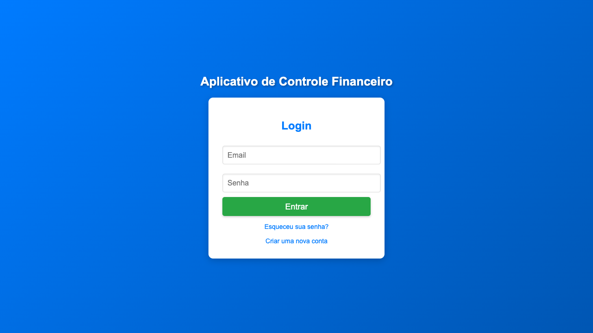
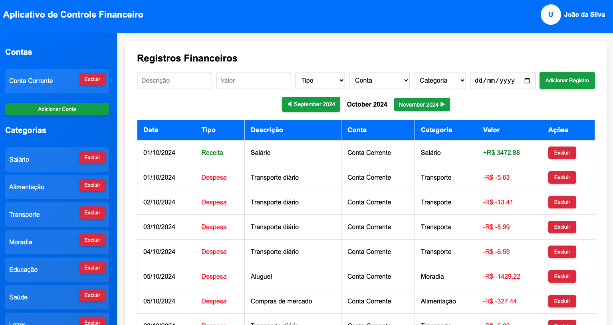
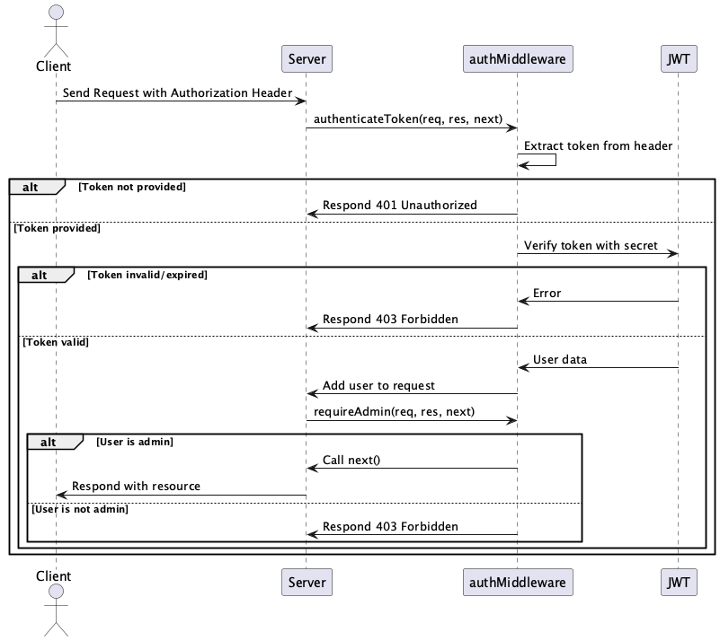

# Web Finances

Este projeto é um sistema de controle financeiro pessoal desenvolvido como trabalho da disciplina **"Tópicos Avançados de Engenharia de Software"**, ministrada pelo professor Bruno Gadelha na **Universidade Federal do Amazonas (UFAM)**.

O objetivo é aplicar conceitos avançados de engenharia de software em um ambiente prático utilizando suporte de LLMs.

## Screenshot





## Como Executar

1. Certifique-se de que o Docker está instalado em sua máquina.
2. No terminal, execute o script `run_docker.sh` para inicializar o sistema:
   ```bash
   ./run_docker.sh
   Isso configurará e iniciará os contêineres necessários para o funcionamento do sistema.
3. O sistema estará disponível no endereço especificado pelo Docker (geralmente http://localhost:3000).

## Arquitetura do Sistema
A arquitetura deste sistema é composta pelos seguintes componentes:

- Front-end: Um conjunto de páginas HTML estáticas que interagem com a API.
- Back-end: Implementado em Node.js, expõe endpoints REST para gerenciamento de finanças pessoais (usuários, categorias, contas, registros financeiros).
- Banco de Dados: Gerenciado via Sequelize, utiliza o padrão relacional.
- Autenticação: Baseada em tokens JWT para segurança e controle de acesso.
- A API segue boas práticas RESTful e está documentada utilizando o padrão Swagger (veja o arquivo src/swagger.yaml).

## Autenticação
O sistema utiliza autenticação baseada em JWT (JSON Web Token). O fluxo é descrito no diagrama abaixo:



1. O cliente envia o token JWT no cabeçalho da requisição HTTP (formato: Authorization: Bearer <token>).
2. O middleware authenticateToken verifica o token:
    - Se o token for inválido ou estiver ausente, a requisição é negada.
    - Caso contrário, os dados do usuário são anexados ao objeto da requisição.
3. O middleware requireAdmin verifica permissões para recursos que exigem privilégios administrativos.